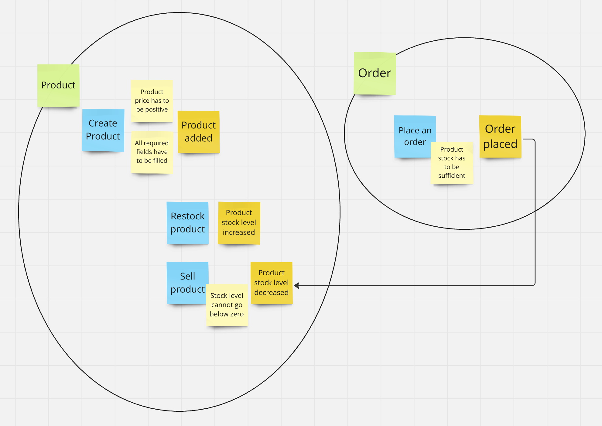

# CQRS Sample Implementation - Simple Inventory Management System

# Project domain

Before I started implementation, I went through specification and made simple 
event storming session to discover all events and commands. 
Here you can find Miro board screenshot:

# Installation:

## Application Setup (local machine)
1. Install dependencies using `$ yarn`
2. Copy `.env.sample` as `.env` to project's root folder
- Select `INTERFACE` between main `http` and sample `cli`.
- Add `MONGODB_URI` to your database. If you didn't setup it yet, check [Database Setup](#database-setup) section.
- Add `MONGODB_DATABASE` with the name of your database.
- You can also pass optionally port number as `PORT`
3. Run application by using `$ yarn start`

### Application Tests
Not the whole API is covered by tests yet, but if you want to run existing, use command: 
`$ yarn test`

### Application setup (Docker Image version) 
1. Run `$ docker compose up`

## Database Setup
1. Run `$ docker compose up -d mongodb` to run *MongoDb* container on your local machine.
4. Now you can connect to your database by passing following uri in .env:
`mongodb://localhost:27017/?directConnection=true`
